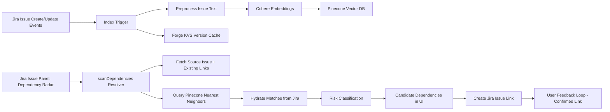

# Dependency Radar

Dependency Radar is a Jira Forge app that detects likely hidden cross-project dependencies before they become sprint blockers.

The system implements the core ideas from the PLD-Engine patent concept: semantic fingerprinting of issue text, nearest-neighbor matching across project boundaries, and actionable dependency recommendations in Jira.

Patent reference: [Predictive Latent Dependency & Bottleneck Detection Engine (PLD-Engine)](https://hello.atlassian.net/wiki/spaces/~712020533f24269dd2463bb6197710ab78c2e8/pages/6357535608/Patent+1+Predictive+Latent+Dependency+Bottleneck+Detection+Engine+PLD-Engine)

## High-Level Architecture



## Core Components

- `src/index-trigger.js`: Event-driven ingestion on `avi:jira:created:issue` and `avi:jira:updated:issue`.
- `src/embeddings.js`: Cohere embedding client and issue text composition logic.
- `src/vectordb.js`: Pinecone upsert/query adapter for vector persistence and similarity search.
- `src/resolvers/index.ts`: End-to-end scan pipeline, risk scoring, Jira hydration, and link creation.
- `src/reindex-trigger.js`: Secure web trigger for project-wide backfill/reindex.
- `src/frontend/index.tsx`: Jira issue panel UI that shows candidates, confidence, risk badges, and one-click linking.

## Implemented Data Flows

### 1) Real-time ingestion and indexing

1. Jira issue create/update event fires a Forge trigger.
2. Trigger extracts summary + description (ADF-to-text when needed).
3. The issue text is transformed into a structured semantic fingerprint.
4. Cohere creates a document embedding.
5. Embedding + metadata are upserted into Pinecone.
6. KVS stores the last indexed `updated` timestamp to skip redundant re-indexing.

### 2) On-demand latent dependency scan

1. User opens the Dependency Radar issue panel.
2. Frontend invokes `scanDependencies` with current issue key.
3. Resolver fetches source issue data and existing issue links.
4. Resolver lazily backfills indexing if source issue version is not yet cached.
5. Resolver creates a query embedding and searches Pinecone (excluding same-project issues).
6. Resolver hydrates matched keys from Jira for fresh status/summary context.
7. Resolver classifies risk:
   - LLM-enabled path (`LLM_PROVIDER=cohere`): semantic risk + dependency type + explanation.
   - Fallback path (`LLM_PROVIDER=none` or failure): cosine-threshold risk mapping.
8. Frontend renders sorted candidate dependencies with similarity and risk signals.

### 3) Analyst feedback loop (confirm dependency)

1. User clicks `Create Link` on a candidate.
2. Frontend invokes `createIssueLink`.
3. Resolver creates a Jira `Relates` link using user context.
4. UI immediately marks candidate as linked, closing the loop with user-confirmed signal.

### 4) Bulk reindex / backfill operations

1. Admin/operator invokes the web trigger with `projects` and optional `force` flag.
2. System paginates issues by project and reuses indexing logic.
3. Results return per-project indexed/skipped/failed counts for operational visibility.

## Mapping to PLD-Engine Vision

Implemented in this repo:
- Semantic overlap detection using issue text embeddings.
- Cross-project nearest-neighbor inference.
- Risk scoring and dependency typing surfaced inside Jira.
- Human-in-the-loop confirmation through explicit issue link creation.

Planned/extendable from patent direction:
- Code proximity signals from Bitbucket/GitHub push data.
- Velocity impact prediction and sprint failure probability modeling.
- Dismiss/negative-reinforcement learning loop and model weight tuning.

## Future Enhancement: Bitbucket-Aware Embeddings and Similarity

To better detect hidden technical coupling, the next enhancement is to add Bitbucket code-change intelligence into the same vector pipeline used for Jira issue text.

### Proposed enhancement flow

1. Ingest Bitbucket push/PR events and map commits to Jira issue keys.
2. Extract code touch points from diffs:
   - Changed file paths and modules
   - API route additions/removals
   - Shared library imports and dependency file changes
3. Build a `code fingerprint` for each issue from recent linked commits.
4. Generate code embeddings (or hybrid text+code embeddings) and store alongside issue vectors.
5. Query similarity using hybrid scoring:
   - `semantic similarity` from issue text
   - `code proximity similarity` from diff fingerprints
   - Optional weighted final score (for example, 60% semantic + 40% code proximity)
6. Surface a stronger risk signal when both semantic overlap and code proximity are high.

### Why this improves dependency detection

- Reduces false positives where text sounds similar but code paths never overlap.
- Catches high-risk collisions where teams modify the same services/libraries with different wording.
- Aligns directly with the PLD-Engine concept of combining work intent and implementation proximity.

## Runtime and Configuration

### Forge modules

- `jira:issuePanel`: Dependency Radar UI.
- `trigger`: index on issue create/update.
- `webtrigger`: project bulk reindex endpoint.

### Required environment variables

- `COHERE_API_KEY`: Cohere API key for embeddings (and LLM analysis if enabled).
- `PINECONE_API_KEY`: Pinecone API key.
- `PINECONE_HOST`: Pinecone index host.
- `PINECONE_NAMESPACE` (optional): defaults to `issues`.
- `LLM_PROVIDER` (optional): `none` (default) or `cohere`.
- `REINDEX_SECRET` (optional but recommended): secures the reindex web trigger.

## Developer Workflow

```bash
npm install
npm run ci
```

`npm run ci` validates manifest rules, type safety, tests, and linting.

## Project Structure

```text
src/
├── frontend/index.tsx        # Jira issue panel UI (Risk Radar experience)
├── resolvers/index.ts        # scanDependencies, createIssueLink, reindexAll
├── index-trigger.js          # Event-based indexing on issue create/update
├── reindex-trigger.js        # Bulk reindex web trigger
├── embeddings.js             # Cohere embedding client + text shaping
├── vectordb.js               # Pinecone upsert/query helpers
├── llm-provider.js           # Optional LLM risk/dependency classification
└── types/index.ts            # Shared domain types
```
